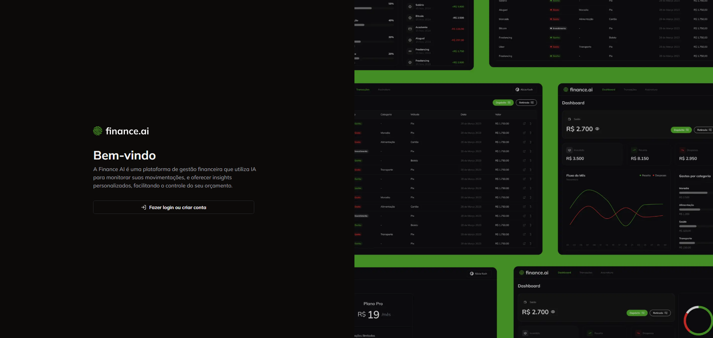
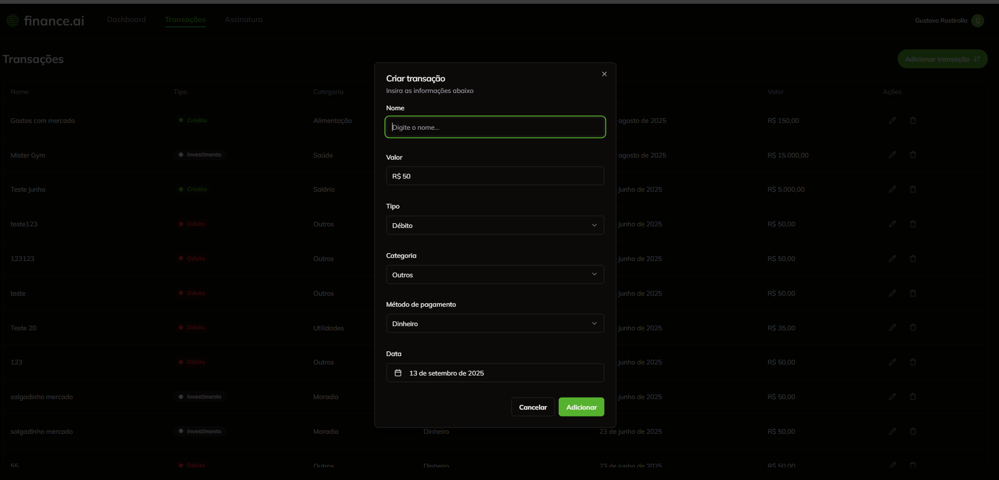
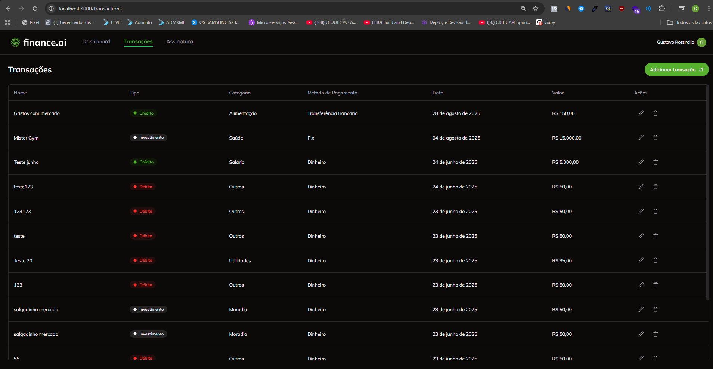
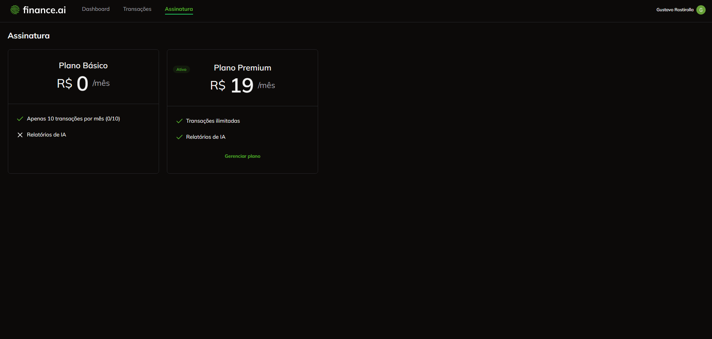

## Title

✂️ FSW FINANCE-AI

## Description

🚀Web system to control your finances and also has limitations depending on the plan you subscribe to

##

This is a [Next.js](https://nextjs.org) project bootstrapped with [`create-next-app`](https://nextjs.org/docs/app/api-reference/cli/create-next-app).

<h1 align="center">
  
  
  
  
  
  
  </h1>

# Table of Contents

<p align="center">
  <a href="#recycle-about-the-project">About the project</a>&nbsp;&nbsp;&nbsp;|&nbsp;&nbsp;&nbsp;
  <a href="#-technologies">Technologies</a>&nbsp;&nbsp;&nbsp;|&nbsp;&nbsp;&nbsp;
  <a href="#-getting-started">Getting Started</a>&nbsp;&nbsp;&nbsp;|&nbsp;&nbsp;&nbsp;
  <a href="#-features">Features</a>&nbsp;&nbsp;&nbsp;|&nbsp;&nbsp;
 
</p>

## 🚀 Technologies

**Language:**

**🛠 Language / Main Framework**

TypeScript
– Superset of JavaScript with static typing

Next.js
– React framework for web applications

**💾 Database / ORM**

PostgreSQL
– Relational database management system

Prisma
– ORM for databases

**🔑 Authentication**

Clerk
– Authentication for Next.js

**💳 Payments / Subscriptions**

Stripe – Subscription and billing management

**📋 Forms / Validation**

React Hook Form
– Form controller

Zod
– Data validation and parsing

**🎨 Styling**

Tailwind CSS
– Utility-first CSS framework

**📅 Dates**

date-fns
– Date utility library

📊 Graphs

Chart.js – Graphs utility library

## 🔗 Features

Login using Clerk (Google authentication supported)

Add a financial transaction

View list of transactions

Edit and delete transactions

Generate financial reports

Manage subscription plans via Stripe

## Getting Started

First, run the development server:

```bash
npm run dev
# or
yarn dev
# or
pnpm dev
# or
bun dev
```

Open [http://localhost:3000](http://localhost:3000) with your browser to see the result.

You can start editing the page by modifying `app/page.tsx`. The page auto-updates as you edit the file.

This project uses [`next/font`](https://nextjs.org/docs/app/building-your-application/optimizing/fonts) to automatically optimize and load [Geist](https://vercel.com/font), a new font family for Vercel.

## Learn More

To learn more about Next.js, take a look at the following resources:

- [Next.js Documentation](https://nextjs.org/docs) - learn about Next.js features and API.
- [Learn Next.js](https://nextjs.org/learn) - an interactive Next.js tutorial.

You can check out [the Next.js GitHub repository](https://github.com/vercel/next.js) - your feedback and contributions are welcome!

## Deploy on Vercel

The easiest way to deploy your Next.js app is to use the [Vercel Platform](https://vercel.com/new?utm_medium=default-template&filter=next.js&utm_source=create-next-app&utm_campaign=create-next-app-readme) from the creators of Next.js.

Check out our [Next.js deployment documentation](https://nextjs.org/docs/app/building-your-application/deploying) for more details.
